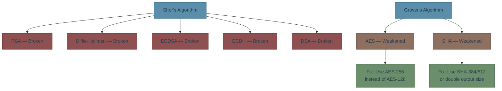
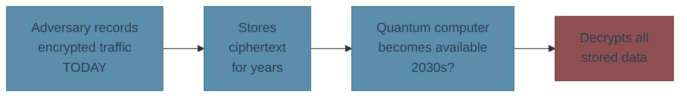
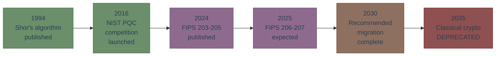

# Why PQC Matters

Every HTTPS connection, SSH session, and VPN tunnel you operate relies on public-key cryptography — RSA, ECDSA, Diffie-Hellman, ECDH. A sufficiently powerful quantum computer breaks **all of them**.

This isn't theoretical hand-wringing. NIST has published replacement standards and set a **2035 deadline** to deprecate classical algorithms.

## What Breaks and Why

In 1994, mathematician Peter Shor discovered a quantum algorithm that efficiently factors large integers and computes discrete logarithms — the two hard problems that all modern public-key crypto depends on.

**The short version**: Shor's algorithm turns exponentially hard problems into polynomial-time problems on a quantum computer. RSA's security comes from "multiplying two primes is easy, factoring the product is hard." A quantum computer makes factoring easy too.

| What | Status | Impact |
|------|--------|--------|
| RSA (all key sizes) | Completely broken | TLS, code signing, certificates |
| ECDSA / EdDSA | Completely broken | TLS, SSH, JWT, blockchain |
| Diffie-Hellman / ECDH | Completely broken | Key exchange in TLS, VPN, SSH |
| AES-128 | Weakened to 64-bit | Use AES-256 instead |
| AES-256 | Safe (128-bit quantum) | No change needed |
| SHA-256 | Weakened to 128-bit | Still adequate for most uses |

**Key takeaway**: All **public-key** cryptography is broken. **Symmetric** cryptography (AES, SHA) survives with larger key/output sizes.

## The Harvest-Now-Decrypt-Later Threat

This is why migration is urgent **today**, even before large quantum computers exist.

Adversaries — nation-states in particular — are recording encrypted traffic **right now**. When quantum computers become available, they'll decrypt everything they've stored.

If your data needs to stay confidential for **more than 10 years** (medical records, financial data, government communications, trade secrets), the threat window is **already open**.

## The Timeline

| Date | Event |
|------|-------|
| 1994 | Shor publishes quantum factoring algorithm |
| 2016 | NIST launches Post-Quantum Cryptography standardization |
| Aug 2024 | FIPS 203 (ML-KEM), 204 (ML-DSA), 205 (SLH-DSA) finalized |
| Mar 2025 | HQC selected as 5th algorithm (will become FIPS 207) |
| 2025 | FIPS 206 (FN-DSA) expected |
| 2035 | **NIST deprecates all quantum-vulnerable algorithms** (NIST IR 8547) |

## What You Should Do Now

1. **Don't panic** — quantum computers capable of breaking crypto don't exist yet (estimated 2030s+)
2. **Do start planning** — migration takes years across large systems
3. **Prioritize key exchange** — this is where harvest-now-decrypt-later hits hardest
4. **Use hybrid mode** — run classical + PQC in parallel during transition (more on this in [Migration Guide]())

**Next**: Learn about the [PQC algorithms]() that replace what's breaking.

---

**Sources**: [NIST PQC Project](https://csrc.nist.gov/projects/post-quantum-cryptography) | [NIST IR 8547 Transition Guidance](https://csrc.nist.gov/pubs/ir/8547/ipd)

*Last updated: 2026-02-13*
