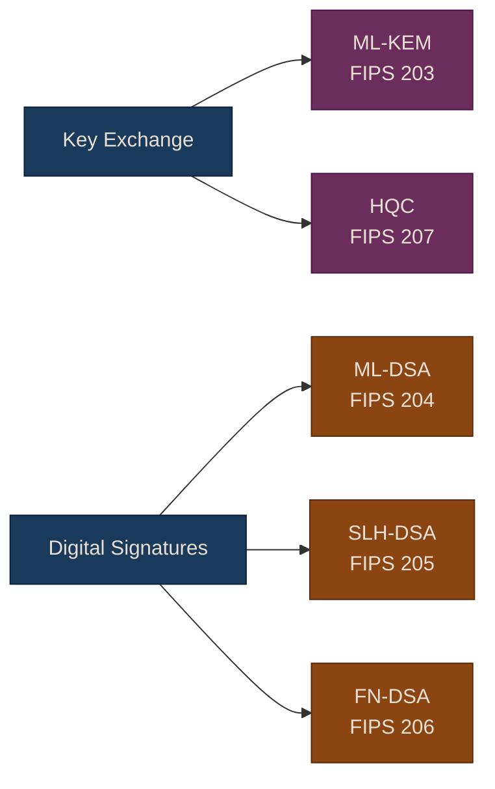
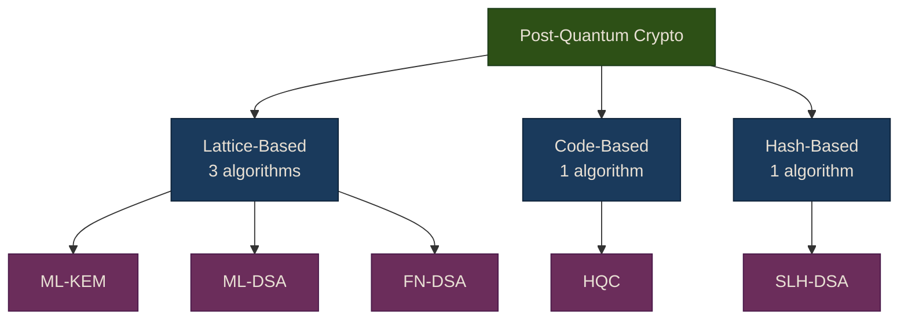

# PQC Algorithms

NIST has standardized 5 post-quantum algorithms across 3 mathematical families. This page explains each family, its strengths and weaknesses, and gives you an "Algorithm Card" for every standardized algorithm.

## Quick Reference: What Do I Use?

**Short answer**: Use **ML-KEM** for key exchange. Use **ML-DSA** for signatures. Everything else is for specific tradeoffs.

## Understanding "KEM" vs. Classical Key Exchange

PQC doesn't do key exchange the same way as Diffie-Hellman. Instead it uses a **Key Encapsulation Mechanism (KEM)**:

1. Alice generates a keypair and sends her public key
2. Bob uses Alice's public key to **encapsulate** a random shared secret, producing a ciphertext
3. Alice uses her private key to **decapsulate** the ciphertext and recover the same shared secret
4. Both sides now have the same key — without ever transmitting it directly

The end result is the same as DH (both sides share a secret key), but the math underneath is completely different and quantum-resistant.

---

## PQC Families

### Family 1: Lattice-Based

**The analogy**: Imagine hiding a needle in a 1000-dimensional haystack. Finding the needle requires searching in so many directions that even a quantum computer can't do it efficiently.

**The math** (simplified): Security comes from the difficulty of finding short vectors in high-dimensional lattices. The Module Learning With Errors (M-LWE) problem adds noise to a system of equations, making them impossible to solve exactly.

| | |
|---|---|
| **Algorithms** | ML-KEM, ML-DSA, FN-DSA (3 of 5 NIST standards) |
| **Used for** | Key exchange AND signatures |
| **Maturity** | ~15 years of intense cryptanalysis |

**Pros**:
- Best all-around performance (fastest operations, reasonable key sizes)
- Covers both KEMs and signatures
- Most extensively analyzed by the cryptographic community
- Standardized by NIST with multiple parameter sets

**Cons**:
- 3 of 5 NIST standards are lattice-based — if a breakthrough breaks lattice math, most PQC is affected
- Larger keys and signatures than classical crypto (but smaller than other PQC families)
- Relatively new compared to code-based crypto (decades vs. 45+ years)

---

### Family 2: Code-Based

**The analogy**: Error-correcting codes are used everywhere — your phone, WiFi, satellites — to fix transmission errors. Code-based crypto uses these codes **backwards**: the sender deliberately introduces errors that only the keyholder can remove.

**The math** (simplified): Security comes from the Syndrome Decoding Problem — given a noisy codeword, decoding it without knowing the secret code structure is NP-hard (even quantum computers can't do it efficiently).

| | |
|---|---|
| **Algorithms** | HQC (FIPS 207) |
| **Used for** | Key exchange only |
| **Maturity** | 45+ years of cryptanalysis (McEliece, 1978) |

**Pros**:
- Longest track record in cryptography — the original McEliece scheme is from 1978 and has never been broken
- Based on an NP-hard problem (syndrome decoding) — strongest theoretical foundation
- Provides algorithmic diversity as a backup to lattice-based algorithms
- Well-understood failure modes and attack surface

**Cons**:
- Larger ciphertexts than lattice-based KEMs (HQC: ~4-7 KB vs. ML-KEM: ~1 KB)
- Slower operations than lattice-based algorithms
- No standardized code-based signature scheme (only KEMs)
- Classic McEliece (highest confidence) was rejected by NIST due to ~1 MB public keys

---

### Family 3: Hash-Based

**The analogy**: Build signatures using only hash functions (like SHA-3). If you trust that SHA-3 is a good hash function — and the entire internet already depends on this — then your signatures are secure. No fancy math required.

**The math** (simplified): Security relies solely on the properties of hash functions: pre-image resistance, collision resistance, and second pre-image resistance. These are the most conservative, minimal assumptions in all of cryptography.

| | |
|---|---|
| **Algorithms** | SLH-DSA (FIPS 205) |
| **Used for** | Signatures only |
| **Maturity** | Hash functions have decades of analysis; hash-based signatures are well-understood |

**Pros**:
- Minimal security assumptions — only relies on hash function security
- Highest confidence among all PQC families — if SHA-3 works, SLH-DSA works
- Tiny public keys (32-64 bytes)
- Simple to understand and implement correctly

**Cons**:
- Very large signatures (7-50 KB vs. ML-DSA's 2-4 KB)
- Slow signing (up to 500ms vs. microseconds for lattice-based)
- Signatures only — cannot do key exchange
- Not practical for high-throughput signing applications

---

## Family Comparison At a Glance

| Property | Lattice-Based | Code-Based | Hash-Based |
|----------|--------------|------------|------------|
| **Confidence level** | High | Very High | Highest |
| **Years of analysis** | ~15 years | 45+ years | Decades (hash functions) |
| **KEMs** | ML-KEM | HQC | None |
| **Signatures** | ML-DSA, FN-DSA | None (standardized) | SLH-DSA |
| **Performance** | Fastest | Moderate | Slowest (signing) |
| **Key sizes** | Small-moderate | Moderate-large | Small keys, large sigs |
| **Risk if family breaks** | 3 of 5 standards affected | 1 standard affected | 1 standard affected |

---

## Algorithm Cards

### ML-KEM (FIPS 203)

| | |
|---|---|
| **Family** | Lattice-based (Module-LWE) |
| **Type** | Key Encapsulation Mechanism |
| **Use case** | Key exchange — replacing ECDH and DH |
| **Think of it as** | "The new Diffie-Hellman" |
| **Formerly** | CRYSTALS-Kyber |

**Parameter sets**:

| Parameter | Security Level | Public Key | Ciphertext | Shared Secret |
|-----------|---------------|------------|------------|---------------|
| ML-KEM-512 | Level 1 (AES-128) | 800 B | 768 B | 32 B |
| ML-KEM-768 | Level 3 (AES-192) | 1,184 B | 1,088 B | 32 B |
| ML-KEM-1024 | Level 5 (AES-256) | 1,568 B | 1,568 B | 32 B |

**Recommendation**: Use **ML-KEM-768** (Level 3) as default. Use ML-KEM-1024 for classified or long-term sensitive data.

---

### ML-DSA (FIPS 204)

| | |
|---|---|
| **Family** | Lattice-based (Module-LWE + Module-SIS) |
| **Type** | Digital Signature |
| **Use case** | Signing — replacing RSA, ECDSA, EdDSA |
| **Think of it as** | "The new RSA/ECDSA for signing" |
| **Formerly** | CRYSTALS-Dilithium |

**Parameter sets**:

| Parameter | Security Level | Public Key | Signature | Signing Speed |
|-----------|---------------|------------|-----------|---------------|
| ML-DSA-44 | Level 2 (AES-128+) | 1,312 B | 2,420 B | ~100 us |
| ML-DSA-65 | Level 3 (AES-192) | 1,952 B | 3,309 B | ~150 us |
| ML-DSA-87 | Level 5 (AES-256) | 2,592 B | 4,627 B | ~250 us |

**Recommendation**: Use **ML-DSA-65** (Level 3) as default. This is your go-to PQC signature algorithm.

---

### SLH-DSA (FIPS 205)

| | |
|---|---|
| **Family** | Hash-based (stateless) |
| **Type** | Digital Signature |
| **Use case** | Signatures when you want maximum conservative security |
| **Think of it as** | "The paranoid option — if SHA-3 works, this works" |
| **Formerly** | SPHINCS+ |

**Parameter sets** (selected — there are 12 total):

| Parameter | Security Level | Public Key | Signature | Signing Speed |
|-----------|---------------|------------|-----------|---------------|
| SLH-DSA-128f | Level 1 | 32 B | 17,088 B | ~5 ms |
| SLH-DSA-192f | Level 3 | 48 B | 35,664 B | ~10 ms |
| SLH-DSA-256f | Level 5 | 64 B | 49,856 B | ~20 ms |

The "f" variants optimize for speed; "s" variants optimize for smaller signatures (but are 10x slower).

**Recommendation**: Use only for high-assurance applications where you need defense-in-depth against a potential lattice breakthrough.

---

### FN-DSA (FIPS 206)

| | |
|---|---|
| **Family** | Lattice-based (NTRU lattices) |
| **Type** | Digital Signature |
| **Use case** | Signatures when compact size matters most |
| **Think of it as** | "The compact option — smallest lattice signatures" |
| **Formerly** | FALCON |

**Parameter sets**:

| Parameter | Security Level | Public Key | Signature |
|-----------|---------------|------------|-----------|
| FN-DSA-512 | Level 1 | 897 B | 666 B |
| FN-DSA-1024 | Level 5 | 1,793 B | 1,280 B |

{: .warning }
> FN-DSA requires **floating-point arithmetic** with strict precision. This makes it harder to implement correctly and unsuitable for some embedded/constrained environments. Use ML-DSA unless you specifically need the smaller signatures.

**Recommendation**: Use when bandwidth is the primary constraint (e.g., certificate chains, IoT). Otherwise prefer ML-DSA.

---

### HQC (FIPS 207)

| | |
|---|---|
| **Family** | Code-based (Hamming Quasi-Cyclic) |
| **Type** | Key Encapsulation Mechanism |
| **Use case** | Key exchange — backup to ML-KEM using different math |
| **Think of it as** | "The backup plan — if lattice math breaks, this still works" |
| **Selected** | March 2025 (draft standard expected ~2026) |

**Parameter sets**:

| Parameter | Security Level | Public Key | Ciphertext | Shared Secret |
|-----------|---------------|------------|------------|---------------|
| HQC-128 | Level 1 | 2,249 B | 4,497 B | 64 B |
| HQC-192 | Level 3 | 4,522 B | 9,042 B | 64 B |
| HQC-256 | Level 5 | 7,245 B | 14,469 B | 64 B |

**Recommendation**: Use as a **diversity backup** alongside ML-KEM, not as a primary replacement. Useful in hybrid constructions where you want security from two independent math families.

---

## NIST Security Levels Explained

NIST defines 5 security levels. In practice, you'll encounter Levels 1, 3, and 5:

| Level | Equivalent To | Use When |
|-------|--------------|----------|
| Level 1 | AES-128 against quantum | General web traffic, short-lived sessions |
| Level 3 | AES-192 against quantum | Business data, most enterprise applications |
| Level 5 | AES-256 against quantum | Classified data, long-term secrets (25+ years) |

**Rule of thumb**: Level 3 is the sweet spot for most applications. Level 1 is fine for short-lived data. Level 5 is for when compromise would be catastrophic.

---

## Which Algorithm Should I Choose?

| If you need... | Use | Why |
|----------------|-----|-----|
| Key exchange (default) | ML-KEM-768 | Best performance, most tested |
| Key exchange (diversity) | ML-KEM + HQC hybrid | Survives if either math family breaks |
| Signatures (default) | ML-DSA-65 | Best balance of size and speed |
| Signatures (smallest) | FN-DSA-512 | 666 B signatures, but needs floating-point |
| Signatures (most conservative) | SLH-DSA | Only depends on hash function security |

**Next**: See the [Algorithm Comparison]() for detailed engineering data (sizes, speeds, memory).

---

**Sources**: [FIPS 203 ML-KEM](https://csrc.nist.gov/pubs/fips/203/final) | [FIPS 204 ML-DSA](https://csrc.nist.gov/pubs/fips/204/final) | [FIPS 205 SLH-DSA](https://csrc.nist.gov/pubs/fips/205/final) | [HQC Selection](https://www.nist.gov/news-events/news/2025/03/nist-selects-hqc-fifth-algorithm-post-quantum-encryption)

*Last updated: 2026-02-13*
