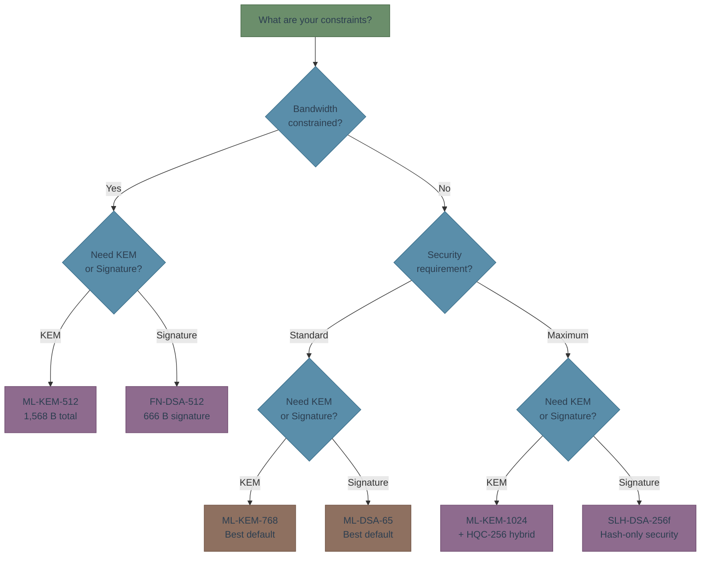

# Algorithm Comparison

This page gives you the engineering data you need to evaluate PQC algorithms: sizes in bytes, speeds in microseconds, and memory in kilobytes. All benchmarks are from NIST submissions and liboqs reference implementations on x86-64 hardware.

## Size Comparison: KEMs

| Algorithm | Level | Public Key | Ciphertext | Total Handshake | Shared Secret |
|-----------|-------|------------|------------|-----------------|---------------|
| **ML-KEM-512** | 1 | 800 B | 768 B | 1,568 B | 32 B |
| **ML-KEM-768** | 3 | 1,184 B | 1,088 B | 2,272 B | 32 B |
| **ML-KEM-1024** | 5 | 1,568 B | 1,568 B | 3,136 B | 32 B |
| **HQC-128** | 1 | 2,249 B | 4,497 B | 6,746 B | 64 B |
| **HQC-192** | 3 | 4,522 B | 9,042 B | 13,564 B | 64 B |
| **HQC-256** | 5 | 7,245 B | 14,469 B | 21,714 B | 64 B |
| *X25519 (classical)* | *~1* | *32 B* | *32 B* | *64 B* | *32 B* |

{: .note }
> ML-KEM total handshake data is **35-49x** larger than X25519. HQC is **105-340x** larger. This matters for bandwidth-constrained links.

## Size Comparison: Signatures

| Algorithm | Level | Public Key | Signature | PK + Sig Total |
|-----------|-------|------------|-----------|----------------|
| **ML-DSA-44** | 2 | 1,312 B | 2,420 B | 3,732 B |
| **ML-DSA-65** | 3 | 1,952 B | 3,309 B | 5,261 B |
| **ML-DSA-87** | 5 | 2,592 B | 4,627 B | 7,219 B |
| **FN-DSA-512** | 1 | 897 B | 666 B | 1,563 B |
| **FN-DSA-1024** | 5 | 1,793 B | 1,280 B | 3,073 B |
| **SLH-DSA-128f** | 1 | 32 B | 17,088 B | 17,120 B |
| **SLH-DSA-192f** | 3 | 48 B | 35,664 B | 35,712 B |
| **SLH-DSA-256f** | 5 | 64 B | 49,856 B | 49,920 B |
| *ECDSA P-256 (classical)* | *~1* | *64 B* | *64 B* | *128 B* |

{: .note }
> PQC signatures are **12-390x** larger than ECDSA. This impacts TLS certificate chains (typically 2-3 signatures), blockchain transactions, and any protocol embedding signatures.

## Speed Comparison: KEMs

Benchmarks on Intel x86-64, single-core, reference implementations.

| Algorithm | Level | KeyGen | Encaps | Decaps |
|-----------|-------|--------|--------|--------|
| **ML-KEM-512** | 1 | 30 us | 37 us | 40 us |
| **ML-KEM-768** | 3 | 51 us | 60 us | 66 us |
| **ML-KEM-1024** | 5 | 78 us | 92 us | 98 us |
| **HQC-128** | 1 | 120 us | 250 us | 420 us |
| **HQC-192** | 3 | 260 us | 570 us | 880 us |
| **HQC-256** | 5 | 410 us | 890 us | 1,380 us |
| *X25519 (classical)* | *~1* | *~50 us* | *~50 us* | *~50 us* |

ML-KEM is comparable to or faster than X25519. HQC is 3-14x slower.

## Speed Comparison: Signatures

| Algorithm | Level | KeyGen | Sign | Verify |
|-----------|-------|--------|------|--------|
| **ML-DSA-44** | 2 | 90 us | 150 us | 90 us |
| **ML-DSA-65** | 3 | 140 us | 230 us | 140 us |
| **ML-DSA-87** | 5 | 210 us | 380 us | 230 us |
| **FN-DSA-512** | 1 | 8,500 us | 350 us | 70 us |
| **FN-DSA-1024** | 5 | 27,000 us | 750 us | 150 us |
| **SLH-DSA-128f** | 1 | 350 us | 5,000 us | 250 us |
| **SLH-DSA-192f** | 3 | 600 us | 10,000 us | 450 us |
| **SLH-DSA-256f** | 5 | 900 us | 20,000 us | 650 us |
| *ECDSA P-256 (classical)* | *~1* | *~30 us* | *~35 us* | *~50 us* |

{: .warning }
> FN-DSA has very slow KeyGen (8-27ms) but fast Sign/Verify. SLH-DSA has very slow Sign (5-20ms). Plan accordingly for high-throughput applications.

## Memory Requirements

| Algorithm | Stack Memory | Heap Allocations |
|-----------|-------------|-----------------|
| ML-KEM-768 | ~3 KB | Minimal |
| ML-DSA-65 | ~10 KB | Minimal |
| FN-DSA-512 | ~40 KB | Floating-point tables |
| SLH-DSA-128f | ~2 KB | Minimal |
| HQC-128 | ~8 KB | Moderate |

ML-KEM and SLH-DSA are well-suited for constrained devices. FN-DSA requires the most memory due to floating-point precomputation.

## Bandwidth Impact on TLS

A typical TLS 1.3 handshake with PQC (hybrid ML-KEM + X25519, ML-DSA certificates):

| Component | Classical | PQC (Level 3) | Increase |
|-----------|-----------|---------------|----------|
| Key exchange | 64 B | 2,336 B (hybrid) | 36x |
| Server cert chain (2 certs) | 128 B sigs | 6,618 B sigs | 52x |
| Total handshake delta | — | ~+9 KB | — |

{: .tip }
> The ~9 KB increase is negligible on broadband but matters on IoT, satellite, or constrained networks. Use Level 1 parameters for constrained environments.

## Decision Flowchart

## Summary: Default Recommendations

| Use Case | Algorithm | Level | Why |
|----------|-----------|-------|-----|
| **Key exchange** | ML-KEM-768 | 3 | Fastest, smallest, most analyzed |
| **Signatures** | ML-DSA-65 | 3 | Best balance of size and speed |
| **Compact signatures** | FN-DSA-512 | 1 | 3.6x smaller than ML-DSA, but needs float |
| **Conservative signatures** | SLH-DSA-128f | 1 | Only depends on hash security |
| **Diverse KEM** | HQC-128 | 1 | Different math family from ML-KEM |

**Next**: See how these algorithms fit into real protocols in [Integration Patterns]().

---

**Sources**: [Open Quantum Safe Benchmarks](https://openquantumsafe.org/benchmarking/) | [liboqs](https://github.com/open-quantum-safe/liboqs)

*Last updated: 2026-02-13*
