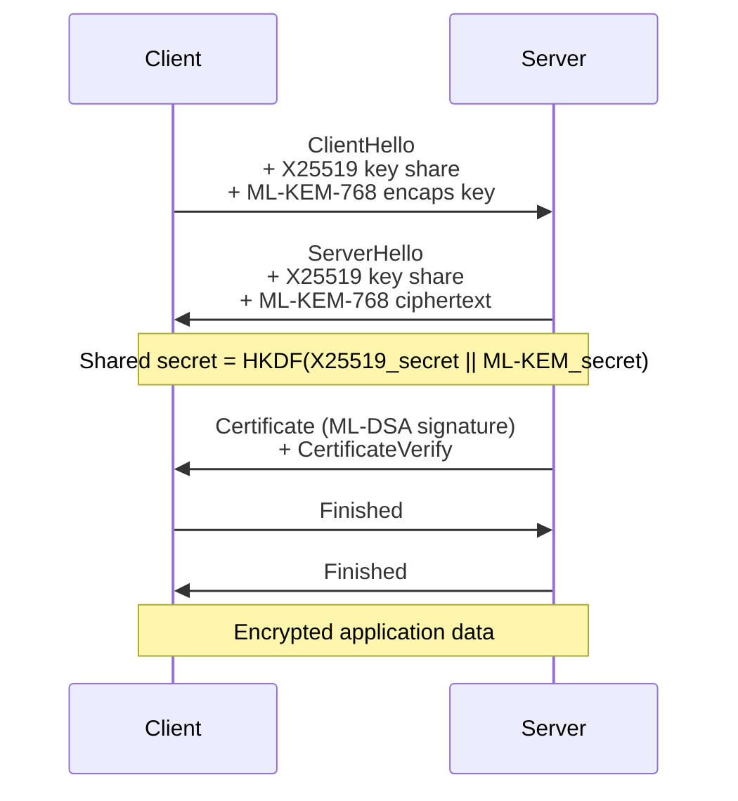
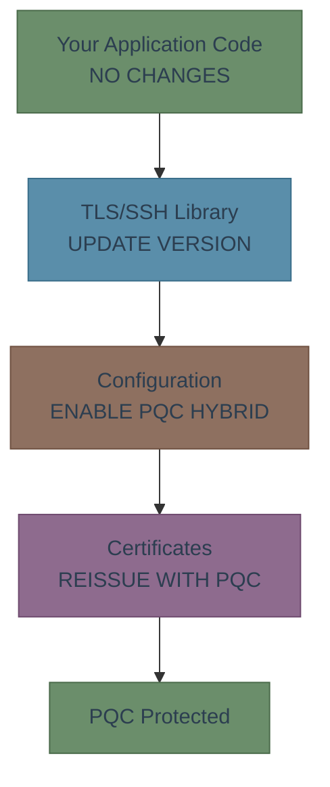

# Integration Patterns

PQC algorithms don't exist in isolation — they plug into protocols you already use. This page shows how PQC fits into TLS, SSH, and VPN, and what changes at each layer.

## The Good News

For most engineers, PQC adoption means **updating your TLS/SSH library** and changing a configuration line. You don't implement the algorithms yourself. The protocol libraries handle the hard parts.

## TLS 1.3 with PQC

TLS 1.3 already supports PQC through hybrid key exchange. Chrome, Firefox, and Cloudflare have deployed it in production.

### How It Works

The TLS handshake uses ML-KEM alongside X25519 (classical ECDH) in **hybrid mode** — both run in parallel, and the shared secret combines both results. If either algorithm is secure, the connection is secure.



### What Changes vs. Classical TLS

| Component | Classical | PQC Hybrid | Impact |
|-----------|-----------|------------|--------|
| Key exchange | X25519 (32 B each) | X25519 + ML-KEM-768 (~2.3 KB) | +2.2 KB in handshake |
| Server signature | ECDSA (64 B) | ML-DSA-65 (3,309 B) | +3.2 KB per cert |
| Certificate chain | ~128 B sigs total | ~6.6 KB sigs total | +6.5 KB (2 certs) |
| Handshake latency | ~1 RTT | ~1 RTT (same) | No change |
| **Total handshake overhead** | — | **~9 KB extra** | — |

{: .tip }
> The extra ~9 KB adds negligible latency on broadband. For satellite or IoT links, consider Level 1 parameters or certificate compression.

### Enabling PQC in Your TLS Stack

**OpenSSL 3.2+** (with oqs-provider):
```
# In openssl.cnf or via API
Groups = X25519MLKEM768:x25519
```

**BoringSSL** (used by Chrome, gRPC):
```
# Enabled by default since Chrome 124
# X25519Kyber768 hybrid
```

**Go 1.23+** (crypto/tls):
```go
// Hybrid X25519+ML-KEM-768 is the default key exchange
tls.Config{
    // PQC is enabled automatically
}
```

**Rust** (rustls with aws-lc-rs):
```rust
// aws-lc-rs supports ML-KEM hybrid
let config = rustls::ServerConfig::builder()
    .with_no_client_auth()
    .with_single_cert(certs, key)?;
```

---

## SSH with PQC

OpenSSH 9.0+ supports post-quantum key exchange using a hybrid of X25519 and a streamlined NTRU Prime scheme.

### What Changes

| Component | Classical | PQC | Impact |
|-----------|-----------|-----|--------|
| Key exchange | curve25519-sha256 | sntrup761x25519-sha512 | +1.2 KB |
| Host key auth | ssh-ed25519 | ssh-ed25519 (unchanged for now) | No change yet |

```
# ~/.ssh/config — prefer PQC key exchange
Host *
    KexAlgorithms sntrup761x25519-sha512@openssh.com,curve25519-sha256
```

{: .note }
> SSH signature algorithms haven't migrated to PQC yet. Host keys and user keys still use Ed25519/RSA. This is the next frontier — expect ML-DSA integration in future OpenSSH releases.

---

## VPN with PQC

### WireGuard

WireGuard uses Noise protocol with X25519. PQC integration is in progress:

- **Rosenpass** project provides a PQC wrapper for WireGuard using Classic McEliece + ML-KEM
- Not yet upstream in WireGuard — requires a separate daemon

### IPsec / IKEv2

- RFC 9370 defines PQC key exchange for IKEv2
- strongSwan 6.0+ supports ML-KEM hybrid key exchange
- Cisco and Juniper have announced PQC support timelines

---

## What You Don't Need to Change

| Layer | PQC Impact | Action |
|-------|------------|--------|
| Application code | None | No code changes |
| Symmetric encryption (AES) | None (use AES-256) | Config change at most |
| Hash functions (SHA) | None | No change |
| TLS library | Update to PQC-capable version | Library upgrade |
| TLS configuration | Enable hybrid key exchange | Config change |
| Certificates | Reissue with PQC signatures | CA-dependent |



**Next**: Find the right PQC library for your language in [Libraries & Tools]().

---

**Sources**: [Cloudflare PQC Deployment](https://blog.cloudflare.com/post-quantum-for-all/) | [OpenSSH 9.0 Release](https://www.openssh.com/txt/release-9.0) | [RFC 9370](https://www.rfc-editor.org/rfc/rfc9370)

*Last updated: 2026-02-13*
