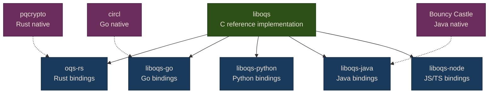
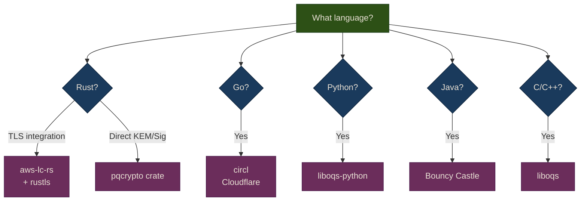

# Libraries & Tools

This page lists the PQC libraries available for each major language, with maturity level, algorithm coverage, and a quick install/usage example.

## Library Ecosystem

Most PQC libraries are bindings to **liboqs** (Open Quantum Safe), the reference C implementation. Some languages have native implementations.



---

## Comparison Table

| Language | Library | Type | ML-KEM | ML-DSA | SLH-DSA | HQC | Maturity |
|----------|---------|------|--------|--------|---------|-----|----------|
| **C/C++** | liboqs | Reference | Yes | Yes | Yes | Yes | Production |
| **C/C++** | PQClean | Reference | Yes | Yes | Yes | Yes | Production |
| **Rust** | pqcrypto | Native | Yes | Yes | Yes | Yes | Stable |
| **Rust** | oqs-rs | Binding | Yes | Yes | Yes | Yes | Stable |
| **Rust** | aws-lc-rs | Native | Yes | Yes | No | No | Production |
| **Go** | circl | Native | Yes | Yes | No | No | Production |
| **Go** | liboqs-go | Binding | Yes | Yes | Yes | Yes | Stable |
| **Python** | liboqs-python | Binding | Yes | Yes | Yes | Yes | Stable |
| **Python** | pqcrypto | Binding | Yes | Yes | Yes | No | Beta |
| **Java** | Bouncy Castle | Native | Yes | Yes | Yes | Yes | Production |
| **Java** | liboqs-java | Binding | Yes | Yes | Yes | Yes | Stable |
| **JS/TS** | liboqs-node | Binding | Yes | Yes | Yes | Yes | Beta |

---

## C/C++ — liboqs

The reference implementation. Everything else builds on this.

```bash
# Install
git clone https://github.com/open-quantum-safe/liboqs.git
cd liboqs && mkdir build && cd build
cmake -GNinja .. && ninja && ninja install
```

```c
#include <oqs/oqs.h>

OQS_KEM *kem = OQS_KEM_new(OQS_KEM_alg_ml_kem_768);
uint8_t *pk = malloc(kem->length_public_key);
uint8_t *sk = malloc(kem->length_secret_key);
OQS_KEM_keypair(kem, pk, sk);
```

---

## Rust

### pqcrypto (native, recommended)

```toml
# Cargo.toml
[dependencies]
pqcrypto-kyber = "0.8"
pqcrypto-dilithium = "0.5"
pqcrypto-traits = "0.3"
```

```rust
use pqcrypto_kyber::kyber768;
use pqcrypto_traits::kem::{PublicKey, SecretKey, SharedSecret, Ciphertext};

let (pk, sk) = kyber768::keypair();
let (ss_sender, ct) = kyber768::encapsulate(&pk);
let ss_receiver = kyber768::decapsulate(&ct, &sk);
assert_eq!(ss_sender.as_bytes(), ss_receiver.as_bytes());
```

### aws-lc-rs (for rustls/TLS integration)

```toml
[dependencies]
aws-lc-rs = "1"  # ML-KEM support for rustls
```

---

## Go

### circl (Cloudflare, recommended)

```bash
go get github.com/cloudflare/circl
```

```go
import "github.com/cloudflare/circl/kem/mlkem/mlkem768"

pk, sk, _ := mlkem768.GenerateKeyPair(rand.Reader)
ct, ss_sender, _ := mlkem768.Encapsulate(rand.Reader, pk)
ss_receiver, _ := mlkem768.Decapsulate(sk, ct)
```

{: .tip }
> Go 1.23+ uses ML-KEM hybrid by default in `crypto/tls`. You may not need to call circl directly.

---

## Python

### liboqs-python

```bash
pip install liboqs-python
```

```python
import oqs

kem = oqs.KeyEncapsulation("ML-KEM-768")
pk = kem.generate_keypair()
ct, ss_sender = kem.encap_secret(pk)
ss_receiver = kem.decap_secret(ct)
assert ss_sender == ss_receiver
```

---

## Java

### Bouncy Castle (recommended)

```xml
<dependency>
    <groupId>org.bouncycastle</groupId>
    <artifactId>bcprov-jdk18on</artifactId>
    <version>1.78</version>
</dependency>
```

```java
import org.bouncycastle.pqc.jcajce.provider.BouncyCastlePQCProvider;

Security.addProvider(new BouncyCastlePQCProvider());
KeyPairGenerator kpg = KeyPairGenerator.getInstance("ML-KEM", "BCPQC");
kpg.initialize(MLKEMParameterSpec.ml_kem_768);
KeyPair kp = kpg.generateKeyPair();
```

---

## JavaScript / TypeScript

### liboqs-node (beta)

```bash
npm install liboqs-node
```

{: .warning }
> The JS/TS ecosystem for PQC is the least mature. For server-side Node.js, consider calling liboqs via FFI or using a Go/Rust service. For browsers, PQC is handled at the TLS layer (Chrome/Firefox already support it).

---

## Choosing a Library



**Next**: Plan your migration from classical to PQC in the [Migration Guide]().

---

**Sources**: [liboqs](https://github.com/open-quantum-safe/liboqs) | [pqcrypto crate](https://crates.io/crates/pqcrypto) | [circl](https://github.com/cloudflare/circl) | [Bouncy Castle](https://www.bouncycastle.org/)

*Last updated: 2026-02-13*
