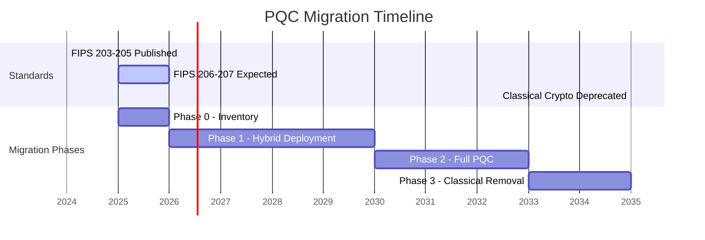
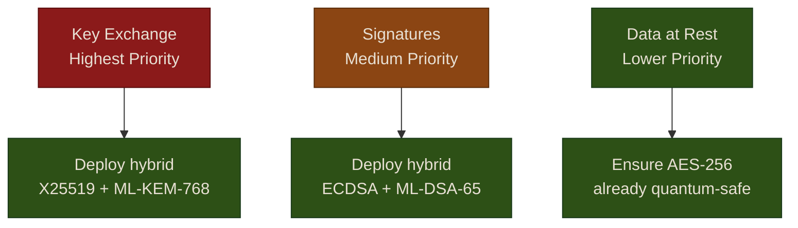
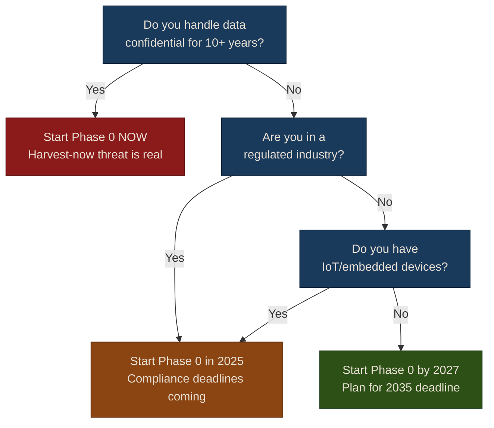

# Migration Guide

Migrating from classical cryptography to PQC is a multi-year effort. This guide gives you a concrete, phased roadmap with entry criteria, actions, and exit criteria for each phase.

## The Timeline

NIST will **deprecate all quantum-vulnerable algorithms by 2035** (NIST IR 8547). Work backward from that deadline.



---

## Phase 0: Inventory (2025-2026)

**Goal**: Know exactly where and how you use cryptography.

### Entry Criteria
- Decision to begin PQC migration
- Engineering team assigned

### Actions

**Crypto Inventory Checklist**:

- [ ] **TLS endpoints**: List all services using TLS. Note TLS library versions.
- [ ] **SSH access**: Inventory SSH key types and key exchange algorithms across all hosts.
- [ ] **VPN connections**: Document VPN protocols and key exchange methods (IKEv2, WireGuard, OpenVPN).
- [ ] **Certificates**: Catalog all X.509 certificates — CA hierarchy, signature algorithms, expiration dates.
- [ ] **Code signing**: Identify all code/artifact signing keys and algorithms.
- [ ] **Data at rest**: Document encryption of stored data — AES key sizes, key wrapping algorithms.
- [ ] **Key management**: Map key derivation, key exchange, and key agreement protocols.
- [ ] **Third-party APIs**: Identify external services and their crypto requirements (mTLS, webhook signatures, JWT).
- [ ] **Embedded/IoT devices**: List constrained devices with crypto — firmware update cycles, hardware crypto capabilities.
- [ ] **Compliance requirements**: Note any regulatory crypto requirements (FIPS 140, PCI-DSS, HIPAA, FedRAMP).

### Exit Criteria
- Complete inventory of all crypto usage with algorithm details
- Risk assessment prioritizing harvest-now-decrypt-later targets
- Migration plan with timeline and resource estimates

---

## Phase 1: Hybrid Deployment (2026-2030)

**Goal**: Deploy PQC alongside classical crypto. Both run in parallel — if either is secure, you're protected.

### Entry Criteria
- Phase 0 inventory complete
- PQC-capable library versions available for your stack

### Actions



**Priority order**:

1. **Key exchange first** — this is where harvest-now-decrypt-later attacks hit. Deploy hybrid X25519+ML-KEM in TLS and SSH.
2. **Signatures second** — less urgent (can't retroactively forge signatures), but needed for certificate chains.
3. **Data at rest** — if you're already using AES-256, you're quantum-safe. Focus on key wrapping and key derivation.

### How Hybrid Mode Works

Hybrid key exchange combines classical and PQC algorithms. The shared secret is derived from **both**:

```
shared_secret = HKDF(classical_secret || pqc_secret)
```

This gives you **AND security** during transition:
- If classical holds but PQC is broken → still secure
- If PQC holds but classical is broken → still secure
- Only fails if **both** are broken simultaneously

### Exit Criteria
- All external-facing TLS endpoints using hybrid PQC key exchange
- SSH key exchange upgraded to PQC hybrid
- VPN connections using PQC key exchange where possible
- New certificates issued with PQC signature algorithms
- Performance impact measured and acceptable

---

## Phase 2: Full PQC (2030-2033)

**Goal**: PQC becomes the primary algorithm. Classical remains as fallback for interoperability.

### Entry Criteria
- Phase 1 hybrid deployment stable in production
- PQC-only standards finalized and widely supported
- Interoperability tested with all partners and clients

### Actions

- Switch from "classical primary, PQC secondary" to "PQC primary, classical fallback"
- Reissue certificate hierarchies with PQC-only root and intermediate CAs
- Update key management systems to generate PQC keys by default
- Begin firmware updates for constrained/IoT devices
- Negotiate PQC requirements with third-party API providers

### Exit Criteria
- All new deployments use PQC-only (no classical)
- Existing deployments run PQC primary with classical fallback
- All certificate chains use PQC signatures
- Constrained devices have PQC-capable firmware

---

## Phase 3: Classical Removal (2033-2035)

**Goal**: Remove classical algorithms entirely before the NIST 2035 deprecation deadline.

### Entry Criteria
- Phase 2 complete — PQC is primary everywhere
- All interoperability partners support PQC-only
- No remaining devices/systems require classical algorithms

### Actions

- Remove classical algorithm support from configurations
- Revoke classical-only certificates
- Update compliance documentation
- Final security audit confirming no classical crypto remains

### Exit Criteria
- Zero classical public-key cryptography in production
- All systems pass compliance audits
- Documentation updated to reflect PQC-only state

---

## Common Pitfalls

{: .warning }
> **Don't skip hybrid mode**. Going directly to PQC-only is risky — PQC algorithms are newer and could have undiscovered vulnerabilities. Hybrid mode protects you either way.

{: .warning }
> **Don't forget certificate chains**. A single classical signature in your cert chain means the chain is quantum-vulnerable. You need PQC signatures at every level (root CA → intermediate → leaf).

{: .warning }
> **Don't ignore third parties**. Your migration timeline depends on your partners, CAs, and cloud providers. Start conversations early.

---

## Migration Decision Map



**Next**: Look up any unfamiliar terms in the [Glossary]().

---

**Sources**: [NIST IR 8547](https://csrc.nist.gov/pubs/ir/8547/ipd) | [CISA PQC Migration](https://www.cisa.gov/quantum)

*Last updated: 2026-02-13*
