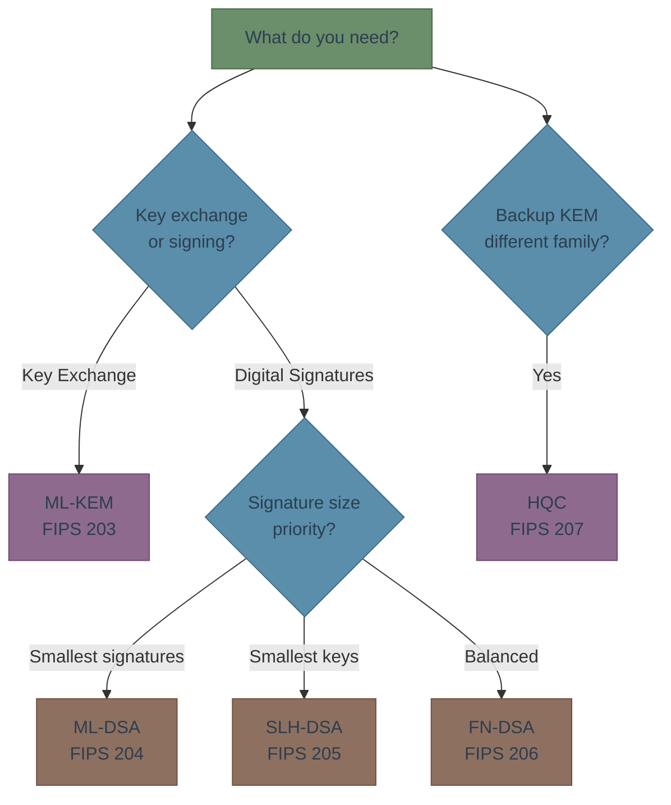

# PQC Engineering Guide

Quantum computers will break the cryptography protecting your applications. This guide helps you understand what's changing, choose the right replacement algorithms, and plan your migration — all without a PhD in mathematics.

## Who This Guide Is For

You're a **backend or infrastructure engineer** who understands TLS, SSH, and key management. You don't need to know lattice theory or formal security proofs. You need to know:

- What's breaking and when
- What to replace it with
- How to do it in your stack

## Guide Contents

| # | Section | What You'll Learn |
|---|---------|-------------------|
| 1 | [Why PQC Matters]() | The quantum threat, what breaks, and the 2035 deadline |
| 2 | [PQC Algorithms]() | The 5 NIST-standardized algorithms and when to use each |
| 3 | [Algorithm Comparison]() | Key sizes, speeds, and memory — engineering data tables |
| 4 | [Integration Patterns]() | How PQC fits into TLS, SSH, and VPN protocols |
| 5 | [Libraries & Tools]() | PQC libraries for Rust, Go, Python, Java, C/C++, and JS |
| 6 | [Migration Guide]() | Four-phase roadmap from classical crypto to PQC |
| 7 | [Glossary]() | PQC terms explained in plain engineering language |

## Quick Decision Tree

## How to Read This Guide

- **In a hurry?** Read [Why PQC Matters]() (10 min) and the [Algorithm Comparison]() tables.
- **Choosing a library?** Jump to [Libraries & Tools]().
- **Planning a migration?** Start with the [Migration Guide]().
- **Reading end-to-end?** Follow sections 1 through 7 in order.

---

*Last updated: 2026-02-13*
